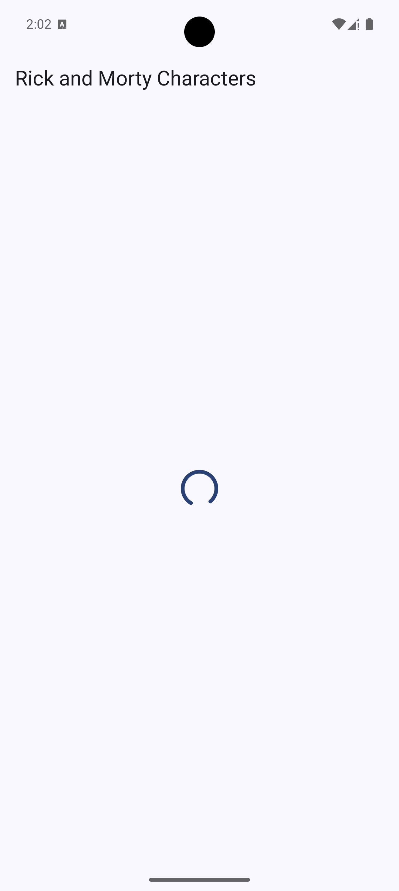
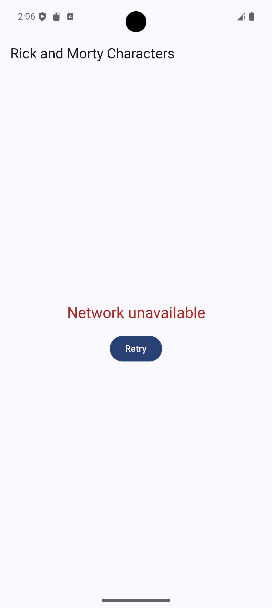

# Rick & Morty App - Android


Esta es una aplicación nativa de Android que consume la API de **Rick & Morty** para mostrar una lista de personajes con paginación. El proyecto ha sido diseñado bajo los principios de **Clean Architecture**, **MVI (Model-View-Intent)** y modularización para garantizar escalabilidad, testabilidad y un flujo de datos unidireccional (UDF).


## 🛠 Stack Tecnológico


-  **Lenguaje:** Kotlin

-  **UI:** Jetpack Compose (100%)

-  **Arquitectura:** Clean Architecture + MVI

-  **Inyección de Dependencias:** Hilt

-  **Asincronía:** Coroutines & Flow

-  **Red:** Retrofit + OkHttp

-  **Carga de Imágenes:** Coil

-  **Pruebas:** JUnit 4, Mockito, Turbine


---


## 🏗 Arquitectura y Estructura


El proyecto está dividido en módulos independientes para separar responsabilidades y facilitar el mantenimiento:


-  **`:app`**: Capa de presentación (UI). Contiene los Composables, ViewModels (MVI) y la lógica de navegación. Depende de `:domain` y `:data`.

-  **`:domain`**: El núcleo del negocio. Contiene las entidades, los contratos de repositorios y los Casos de Uso (Interactors). Es un módulo puramente Kotlin, agnóstico a Android.

-  **`:data`**: Implementación de los repositorios, fuentes de datos (API de Rick & Morty) y Mappers.

-  **`:logger`**: Módulo auxiliar para el manejo de logs en el sistema.

## 📸 Screenshots

| Personajes (Éxito) | Cargando (Loading) | Sin Internet (Error) |
| :---: | :---: | :---: |
|  |  |  |


### 🔄 MVI & Unidirectional Data Flow (UDF)


Se eligió el patrón **MVI** sobre MVVM para aprovechar al máximo **Jetpack Compose**. Al centralizar el estado de la UI en un único objeto inmutable, logramos:


1.  **Predicibilidad:** Un flujo de datos claro (`Action` -> `ViewModel` -> `State`).

2.  **Optimización de Recomposiciones:** Reducción de disparos innecesarios en Compose mediante el manejo de estados atómicos.

3.  **Manejo de Side Effects:** Uso de `Events` para acciones rapidas como mostrar errores específicos.


---


## 🚀 Decisiones Técnicas Destacadas


### 📦 Paginación Personalizada (Custom Pagination)


En este proyecto se optó por una **paginación manual controlada desde el UseCase**.


**¿Por qué?**

Paging 3 introduce su propio `LoadState`, lo que a menudo "rompe" el patrón MVI puro al forzarte a manejar estados externos. Mi implementación permite:

- Mantener el control total sobre la lista de personajes dentro de mi `CharacterListState`.

- Integrar la lógica de carga de forma transparente en el flujo UDF.

- Personalizar el manejo de errores de paginación (ej: mostrar un Snackbar sin eliminar los datos ya cargados).


### 🛡 Manejo Funcional de Errores (`UseCaseResult`)


A diferencia del manejo tradicional mediante bloques `try-catch`, este proyecto utiliza una aproximación **funcional** para el control de errores mediante la clase `UseCaseResult`.


**¿Por qué este enfoque?**

1.  **Errores:** Los fallos (red, datos vacíos, etc.) no son accidentes, son escenarios esperados de la lógica de negocio. Al incluirlos en el tipo de retorno, obligamos al consumidor (ViewModel) a manejarlos explícitamente.

2.  **Seguridad de Tipos (Type Safety):** Gracias a las `sealed classes` de Kotlin, el compilador garantiza que todos los escenarios de error sean considerados, eliminando sorpresas en tiempo de ejecución.

3.  **Arquitectura Limpia:** Mantiene la capa de dominio pura. Las excepciones suelen "saltarse" las capas de la arquitectura, mientras que un `Result` fluye de manera controlada de una capa a otra.


### 🚫 ¿Por qué no uso`throw exceptions` en el flujo de negocio?


En este desarrollo, se ha evitado lanzar excepciones para el flujo normal de la aplicación (dominio y presentación) por motivos de diseño robusto:

-  **Control de Flujo:** Las excepciones son, en esencia, sentencias `GOTO` ocultas que rompen la legibilidad y predictibilidad del código.

-  **Diferenciación:** Las excepciones son únicamente para errores "catastroficos" de programación que no pueden ser recuperados.


#### 🛡️ Excepciones en la Capa de Datos

Es importante destacar que la **capa de datos** sí interactúa con excepciones (lanzadas por librerías como Retrofit u OkHttp). Sin embargo, estas **nunca escapan al dominio**:

1.  **Base Repository:** Se utiliza el método `safeCall` en `BaseRepository` para envolver las llamadas de red en bloques `try-catch`.

2.  **Mapeo a `UseCaseResult`:** Cada excepción técnica (ej: `IOException`, `HttpException`) se mapea inmediatamente a un tipo controlado de `UseCaseResult.Reason`.

3.  **Transparencia:** El resto de la aplicación maneja un paradigma funcional, ignorando la existencia de excepciones técnicas y tratando los errores como datos.


### 🛡 Manejo de Errores y Resiliencia


La app utiliza un wrapper de resultados (`UseCaseResult`) para propagar fallos desde la capa de datos.

-  **Mapeo de Errores:** Errores de red, errores de data vacia o inexistente y errores desconocidos.

-  **Recuperación:** Implementación de un mecanismo de "Retry" para reintentar cargas fallidas.

### 🧪 Estrategia de Testing


Se implementaron pruebas unitarias utilizando un enfoque de **Behavior-Driven Development (BDD)**:

-  **ViewModels:** Verificación de transiciones de estado y disparo de eventos ante acciones específicas.

-  **Casos de Uso:** Validación de la lógica de negocio y el correcto flujo de los repositorios.

-  **Turbine:** Utilizado para testear flujos de Flow de manera sencilla y robustas.


---


## 📥 Instalación


1. Clona el repositorio:

```bash

git clone https://github.com/tu-usuario/rickandmortyapp.git

```

2. Abre el proyecto en **Android Studio**.

3. Sincroniza el proyecto con Gradle.

4. Ejecuta la app en un emulador o dispositivo físico.


---
